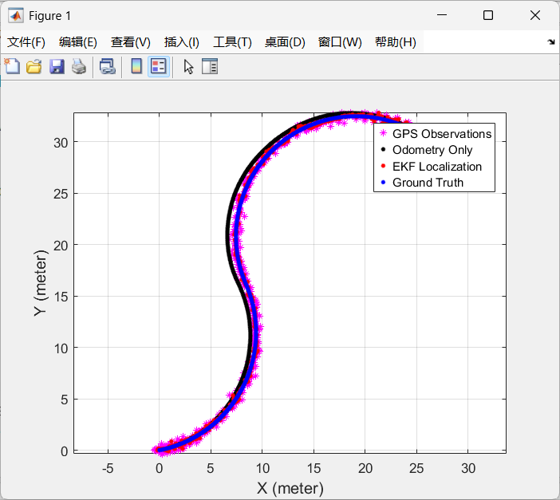
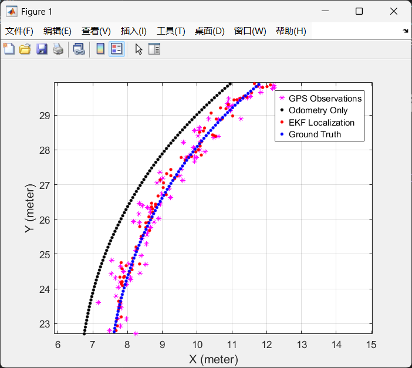

3220104688 杨佳昕


# 一、协方差矩阵convQ和convR

代码中：

$$
noiseQ = \left[\begin{matrix}0.1&0&0\\0&0&0\\0&0&10\circ\end{matrix}\right]^2
$$

*noiseQ*已经定义了$v_x$的不确定性$noiseQ(1,1)$，$v_y$的不确定性$noiseQ(2,2)$和$w$的不确定性$noiseQ(3,3)$，因此*noiseQ*就是输入的噪声协方差矩阵，也就是运动噪声的协方差矩阵*convQ*.

同理，*noiseR*是观测噪声的协方差矩阵，也即观测噪声的协方差矩阵*convR*，因此有：

```matlab
convQ = noiseQ;
convR = noiseR;
```


# 二、运动模型doMotion()和雅可比矩阵jacobF()

doMotion()函数的输入为$x = \left[\begin{matrix} x \\ y \\ \theta\end{matrix}\right]$和$u = \left[\begin{matrix} v_x \\ v_y \\ w \end{matrix}\right]$.

机器人是否走直线取决于$w$的大小，这里先设定阈值$threshold=10^{-10}$.

## 1. 直线运动的doMotion()函数

$x(t), y(t)$分别表示机器人在x,y轴方向上的坐标，$v_x, v_y$分别表示机器人在沿其前进方向和垂直于其前进方向上的线速度。

根据作业需求，机器人向右上角运动，则水平方向的位移分量：

$$
\Delta x(t) + v_x cos(\theta)dt - v_y sin(\theta)dt
$$

垂直方向的位移分量：

$$
\Delta y(t) + v_x sin(\theta)dt + v_y cos(\theta)dt
$$

## 2. 曲线运动的doMotion()函数

水平方向的位移分量：

$$
\Delta_1 x(t) = \int_0^{dt} v_x cos(\theta+wt)dt = \frac{1}{w}v_x sin(\theta+wdt) - \frac{1}{w}v_x sin\theta
$$
$$
\Delta_2 x(t) = \int_0^{dt} v_y sin(\theta+wt)dt = -\frac{1}{w}v_y cos(\theta+wdt) + \frac{1}{w} v_y cos\theta
$$
$$ \Delta x(t) = \Delta_1 x(t) - \Delta_2 x(t) $$

垂直方向的位移分量：

$$
\Delta_1 y(t) = \int_0^{dt} v_x sin(\theta+wt)dt = -\frac{1}{w}v_x cos(\theta+wdt) + \frac{1}{w}v_x cos\theta
$$
$$
\Delta_2 y(t) = \int_0^{dt} v_y cos(\theta+wt)dt = \frac{1}{w}v_y sin(\theta+wdt) - \frac{1}{w} v_y sin\theta
$$
$$ \Delta y(t) = \Delta_1 y(t) + \Delta_2 y(t) $$

此外，角度变化$\Delta \theta = wdt$.

## 3. 雅可比矩阵jacobF()

$J = \left[\begin{matrix}\frac{\partial x_{next}}{\partial x}&\frac{\partial x_{next}}{\partial y}&\frac{\partial x_{next}}{\partial \theta}\\\frac{\partial y_{next}}{\partial x}&\frac{\partial y_{next}}{\partial y}&\frac{\partial y_{next}}{\partial \theta}\\\frac{\partial \theta_{next}}{\partial x}&\frac{\partial \theta_{next}}{\partial y}&\frac{\partial \theta_{next}}{\partial \theta}\end{matrix}\right]$，则：

## 1. 对直线运动

$$ x_{next} = x + v_x cos(\theta)dt - v_y sin(\theta)dt $$
$$ y_{next} = y + v_x sin(\theta)dt + v_y cos(\theta)dt $$
$$ \theta_{next} = \theta + wdt $$
$$ J = \left[\begin{matrix} 1 & 0 & (-v_x sin\theta + v_y cos\theta)dt \\ 0 & 1 & (v_x cos\theta - v_y sin\theta)dt \\ 0 & 0 & 1\end{matrix}\right] $$

## 2. 对曲线运动

$$ x_{next} = x + \frac{1}{w}v_x sin(\theta+wdt) - \frac{1}{w}v_x sin\theta +\frac{1}{w}v_y cos(\theta+wdt) - \frac{1}{w} v_y cos\theta $$
$$ y_{next} = y - \frac{1}{w}v_x cos(\theta+wdt) + \frac{1}{w}v_x cos\theta + \frac{1}{w}v_y sin(\theta+wdt) - \frac{1}{w} v_y sin\theta $$
$$ \theta_{next} = \theta + wdt $$
$$ J = \left[\begin{matrix}1 & 0 & \frac{1}{w}v_x cos(\theta + wdt)-\frac{1}{w}v_x cos\theta - \frac{1}{w}v_y sin(\theta + wdt) + \frac{1}{w}v_y sin\theta \\ 0 & 1 & \frac{1}{w}v_x sin(\theta + wdt) - \frac{1}{w} v_x sin\theta + \frac{1}{w}v_y cos(\theta + wdt) - \frac{1}{w}v_y cos\theta \\ 0&0&1\end{matrix}\right] $$

# 三、雅可比矩阵jacobH()

## 1. doObservation()函数

对于观测模型doObservation()，只需要获取当前的$[x, y, \theta]^T$即可，即：
$$
x = \left[\begin{matrix}x_{pred} \\ y_{pred} \\ \theta_{pred}\end{matrix}\right]
$$

## 2. 雅可比矩阵jacobH()

jacobH()的输入为$x = \left[\begin{matrix} x \\ y \\ \theta\end{matrix}\right]$，则：

$$
J = \left[\begin{matrix}\frac{\partial x}{\partial x}&\frac{\partial x}{\partial y}&\frac{\partial x}{\partial \theta}\\\frac{\partial y}{\partial x}&\frac{\partial y}{\partial y}&\frac{\partial y}{\partial \theta}\\\frac{\partial \theta}{\partial x}&\frac{\partial \theta}{\partial y}&\frac{\partial \theta}{\partial \theta}\end{matrix}\right] = \left[\begin{matrix}1&0&0\\0&1&0\\0&0&1\end{matrix}\right]
$$

# 四、卡尔曼滤波

## 1. 预测阶段

基于机器人当前的状态$x = \left[\begin{matrix} x \\ y \\ \theta\end{matrix}\right]$，输入$u = \left[\begin{matrix} v_x \\ v_y \\ w \end{matrix}\right]$和GPS数据$z = \left[\begin{matrix} x_{GPS} \\ y_{GPS} \\ \theta_{GPS}\end{matrix}\right]$，下一时刻的位置可以预测为：

$$
x_{pred} = f(x_{Ekf}, u)
$$

其中$f$为doMotion()函数。预测状态的协方差矩阵为：

$$
P_{pred} = J_F P_{Ekf} J_F^T + Q
$$

其中，$P_{pred}$为预测协方差矩阵，$J_F$为雅可比矩阵，$P_{Ekf}$为状态协方差矩阵，$Q$为运动噪声协方差矩阵*convQ*.

## 2. 更新阶段

观测雅可比矩阵部分输入为预测的状态$x_{pred}$，输出为雅可比矩阵$J_H$。

观测值$z_{pred} = h(x_{pred})$，其中$h$为doObservation()函数。则：

残差：

$$ y = z - z_{pred} $$

残差的协方差矩阵：

$$ S = J_H P_{pred} J_H^T + R $$

其中，$R$是观测噪声协方差矩阵*convR*. 卡尔曼增益：

$$ K = P_{pred} J_H^T S^{-1} $$

利用卡尔曼增益修正预测状态和协方差矩阵：

$$ x_{Ekf} = x_{pred} + Ky $$
$$ P_{Ekf} = (I - K J_H) P_{pred} $$

# 五、误差计算

## 1. 纯里程计误差

$$ error_{odom} = \sqrt{(x_{truth} - x_{odom})^2 + (y_{truth} - y_{odom})^2}$$

## 2. EKF定位误差

$$ error_{Ekf} = \sqrt{(x_{truth} + x_{Ekf})^2 + (y_{truth} - y_{Ekf})^2} $$

## 3. 计算平均误差

$$ \overline {error}_{odom} = error_{odom} / num $$
$$ \overline {error}_{Ekf} = error_{Ekf} / num $$
平均误差可以直接使用mean()函数计算。


# 六、实验结果

运行效果如下：





两图分别为定位结果的全局显示与局部放大，蓝色点为真值，黑色点为纯里程计累积，红色为EKF定位结果，洋红色为GPS观测。

**disp()函数输出：**
Odom Error: 0.54932
Ekf Error: 0.18756

# 七、改进方向

1. 运动噪声协方差矩阵$convQ = \left[\begin{matrix}0.1&0&0\\0&0&0\\0&0&10\circ\end{matrix}\right]^2$和观测噪声协方差矩阵$convR = \left[\begin{matrix}0.5&0&0\\0&0.5&0\\0&0&5\circ\end{matrix}\right]^2$的参数值依赖于题目已经给定的噪声水平，而并不是实际的噪声水平。可以添加相关的传感器，动态调节两个矩阵的值。

2. 计算卡尔曼增益$K$时，计算方法是静态的，即：

```matlab
K = PPred * jH' / S;
```

如果*convQ*和*convR*可以动态调整，那么也可以动态调整卡尔曼增益$K$. 设定阈值*threshold_high*和*threshold_low*，代码如下：

```matlab
error_y = norm(y);

if error_y > threshold_high
	convQ = convQ * 1.2;
	convR = convR * 0.8;
elseif error_y < threshold_low
	convQ = convQ * 0.8;
	convR = convR * 1.2;
end

S = jH * PPred * jH' + convR;
K = PPred * jH' / S;
```

当残差较大时，认为当前观测不可靠，因此增加运动噪声协方差矩阵值，降低观测噪声协方差矩阵值。

反之，当残差较小时，认为当前观测可靠，因此降低运动噪声协方差矩阵值，增加观测噪声协方差矩阵值。

对*convQ*和*convR*的增减参数值可以适当调节。

---
<b><font color=YellowGreen face=Consolas>Intelligent Mobile Technology - EKF</font></b>
<b><font color=YellowGreen face=Consolas>JiaXin Yang</font></b>
<b><font color=YellowGreen face=Consolas>7 Apr, 2025</font></b>


